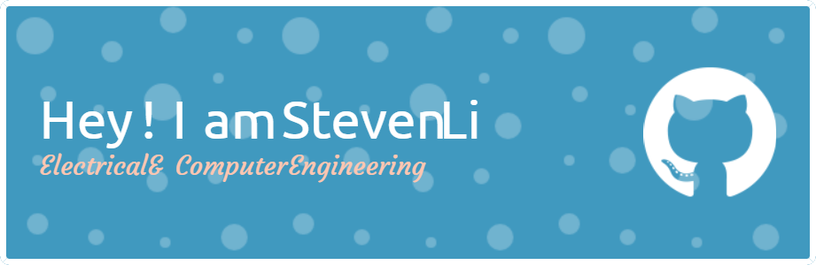

# Background
- 👋 Hi there, This is Chengming(Steven) Li
- :man_student: MS ECE(EC79) Student at University of California San Diego,
- :man_student: BS ECE Student at University of Colorado Boulder,
# Currently Learning 🌱
- 👀 I’m interested in Hardware, Embedded System Development
- 📚 I’m currently learning Analog Integrated Circuit Deisgn, VLSI and Modern Network 
# Connect me @

- :email: [MyEmail](stevenlcm16@gmail.com)
- :santa: [Linkedin](http://linkedin.com/in/chengming-li-425575226)
- :superhero_man: [Personal Portfolio](http://sites.google.com/colorado.edu/chengming-li/home)

<!---
stevenli518/stevenli518 is a ✨ special ✨ repository because its `README.md` (this file) appears on your GitHub profile.
You can click the Preview link to take a look at your changes.
--->
